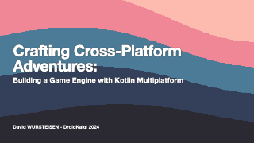
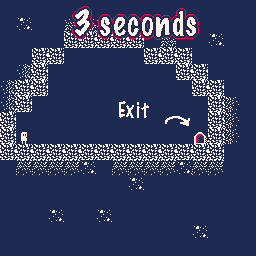
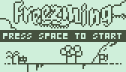
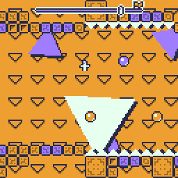

# 🧸 Tiny Game Engine

> 🎮 Tiny is a lightweight, cross-platform game engine powered by Lua — perfect for small games, game jams, and rapid prototyping.


[](https://github.com/minigdx/tiny/releases)
[](https://github.com/minigdx/tiny/blob/main/LICENSE)

---

## ✨ Features

- 🖥️ & 🌐 **Multiplatform** – Runs on desktop and web
- ✍️ **Lua scripting** – Simple, flexible, and fast
- 🔄 **Hot reload** – Instantly see your code changes
- 🪶 **Lightweight** – No bloat, just the essentials for small games

---

## 🚀 Getting Started

Create your first game with just a few lines of Lua:

```lua
function _draw()
    -- draw a rectangle at {x: 10, y: 10} with the size {width: 100, height: 50} 
    shape.rectf(10, 10, 100, 50)
end
```

➡️ Read the [Getting Started Guide](https://minigdx.github.io/tiny/) to set up the engine and start creating!

---

## 📦 Download

Get the latest version from the [Releases Page](https://github.com/minigdx/tiny/releases).

---

## 📚 Documentation

Full documentation is available on the [Tiny website](https://minigdx.github.io/tiny/), including:

- Engine setup
- Lua API reference
- Examples and tutorials

🗣️ A behind-the-scenes presentation was given at [DroidKaigi 2024 – Tokyo](https://2024.droidkaigi.jp/en/timetable/683368/):
- 📽️ [Watch the session on YouTube](https://www.youtube.com/watch?v=4_i_Xp96IMM)
- 📑 [View the slides](https://speakerdeck.com/dwursteisen/crafting-cross-platform-adventures-building-a-game-engine-with-kotlin-multiplatform)

[](https://speakerdeck.com/dwursteisen/crafting-cross-platform-adventures-building-a-game-engine-with-kotlin-multiplatform)

---

## 🎮 Games Made With Tiny

Want to create games like these? Dive into the docs and start building:

[](https://dwursteisen.itch.io/trijam-camping)
[](https://dwursteisen.itch.io/trijam-220-type-it)
[](https://dwursteisen.itch.io/memory-pong-trijam-251)
[](https://dwursteisen.itch.io/one-light-for-three-seconds)
[](https://dwursteisen.itch.io/connect-me)
[](https://dwursteisen.itch.io/meiro-de)
[](https://dwursteisen.itch.io/freezming)
[](https://dwursteisen.itch.io/gravity-balls)

---

## 📄 License

🧸 Tiny is open-source software licensed under the [MIT License](https://github.com/minigdx/tiny/blob/main/LICENSE).

Use it freely in personal, jam, or commercial projects.

---

## 🛠️ Tech Overview

| Core           | Scripting | Platforms       | License |
|----------------|-----------|------------------|---------|
| Kotlin Multiplatform | Lua       | Desktop, Web      | MIT     |
