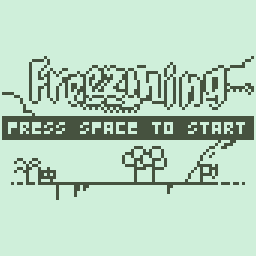

# 🧸 Tiny Game Engine

🧸 Tiny is a lightweight, multiplatform game engine that allows developers to create games using the scripting language Lua. It is designed for creating small, short games, making it ideal for game jams and quick game development.

## Features

- Multiplatform: Tiny can be used on both desktop and web platforms.
- Scripting with Lua: The engine allows developers to use Lua scripting language to create their games.
- Hot Reload: The engine supports hot reload, making it easy for developers to quickly make changes and see the results immediately.
- Simple and Lightweight: The engine is designed to be simple and lightweight, making it ideal for small and short games.

## Download

- Latest version can be downloaded on [the release page](https://github.com/minigdx/tiny/releases).

## Documentation

The Tiny game engine comes with extensive documentation that covers everything from installing the engine to creating games. The documentation is available on the [GitHub website](https://minigdx.github.io/tiny/).

A presentation about the technologies used behind 🧸 Tiny was also given during the conference [DroidKaigi 2024 @ 東京 Tokyo](https://2024.droidkaigi.jp/en/timetable/683368/). You can check [the slides](https://speakerdeck.com/dwursteisen/crafting-cross-platform-adventures-building-a-game-engine-with-kotlin-multiplatform), or you also [watch the session](https://www.youtube.com/watch?v=4_i_Xp96IMM).

## Games

Want to build a game like those? Read the documentation above ⬆️ and start to build your own!

## Community

Tiny has a growing community of developers who use the engine to create games. You can join the community on social media platforms like Twitter, itch.io and Reddit.

## License

The Tiny game engine is open source software, released under the MIT license. You can use it for both commercial and non-commercial projects.
