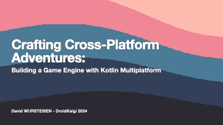

:docinfo: shared
:icons: font
:book:
:source-highlighter: rouge
:favicon: ./sample/favicon.png
:stylesheet: adoc-riak.css
:description: Tiny game engine documentation - installation guide, tutorial, API reference, showcase, and more.
:keywords: game engine, lua, virtual console, fantasy console, retro games, pixel art, indie game development, kotlin multiplatform, game jam, hot reload
:author: Tiny Game Engine Contributors

= Tiny Documentation

== Tiny Engine

Tiny is a free, open-source **fantasy console** and **lightweight game engine** for creating retro-style games using **Lua scripting**. Build pixel art games with a 256-color palette, test instantly with hot reload, and export to **desktop and web** platforms. Ideal for **game jams**, rapid prototyping, and learning game development.

Create and test your ideas quickly and effectively. Run your games on your desktop computer and export them for the web, making it easy to share your creations with others. Get started right away and see your progress in real-time, thanks to Tiny's **hot reloading** feature.

++++
<iframe class="no-resize" title="Breakout example game built with Tiny game engine" loading="lazy" width="516" height="516" src="sample/game-example/index.html"></iframe>
++++

NOTE: The code source of this sample is available in the https://github.com/minigdx/tiny/tree/main/tiny-samples/breakout[Tiny git repository].

== Quick Navigation

New to Tiny? Start here:

 1. **link:tiny-install.html[Installation]** - Get Tiny up and running
 2. **link:tiny-tutorial.html[Tutorial: Pong]** - Build a complete Pong game
 3. **link:tiny-tutorial-export.html[Exporting]** - Share your game on the web
 4. **link:tiny-tutorial-sprites.html[Sprites]** - Manage sprites and animation
 5. **link:tiny-tutorial-maps.html[Maps]** - Build levels with LDtk
 6. **link:tiny-fonts.html[Fonts]** - Use custom bitmap fonts
 7. **link:tiny-tutorial-sound.html[Sound]** - Add sound effects to your game
 8. **link:api.html[API Reference]** - Complete function documentation
 9. **link:tiny-cli.html[CLI Commands]** - Command-line tools

=== Resources
 - https://github.com/minigdx/tiny[GitHub Repository]
 - https://github.com/minigdx/tiny/releases[Download Latest Release]

== Tiny Editor

You can try creating a game right away with `Tiny` using link:editor.html?game=[the Editor], or you can experiment by updating the examples available on this page.

== Tiny is open source

`Tiny` is an open-source project. Users can contribute to the project by reporting issues, suggesting improvements, and even submitting code changes. https://github.com/minigdx/tiny[Check the code source on Github].

Contributions from the community are welcome, and can help to improve the overall functionality and usability of the game engine!

A presentation about the technologies used behind Tiny was also given during the conference https://2024.droidkaigi.jp/en/timetable/683368/[DroidKaigi 2024 @ Tokyo]. You can check https://speakerdeck.com/dwursteisen/crafting-cross-platform-adventures-building-a-game-engine-with-kotlin-multiplatform[the slides], or you also https://www.youtube.com/watch?v=4_i_Xp96IMM[watch the session].

TIP: Want to help make this documentation even better? Feel free to contribute by updating https://github.com/minigdx/tiny/tree/main/tiny-doc/src/docs/asciidoc[the documentation source code]!

include::tiny-install.adoc[leveloffset=+1]

include::tiny-tutorial.adoc[leveloffset=+1]

include::tiny-tutorial-export.adoc[leveloffset=+1]

include::tiny-tutorial-sprites.adoc[leveloffset=+1]

include::tiny-tutorial-maps.adoc[leveloffset=+1]

include::tiny-fonts.adoc[leveloffset=+1]

include::tiny-tutorial-sound.adoc[leveloffset=+1]

include::tiny-showcase.adoc[]

== Links

- https://tomhalligan.substack.com/p/tinkering-with-tiny[Tinkering with Tiny]
- https://tomhalligan.substack.com/p/tiny-gardening[Tiny Gardening]

include::licences.adoc[]
