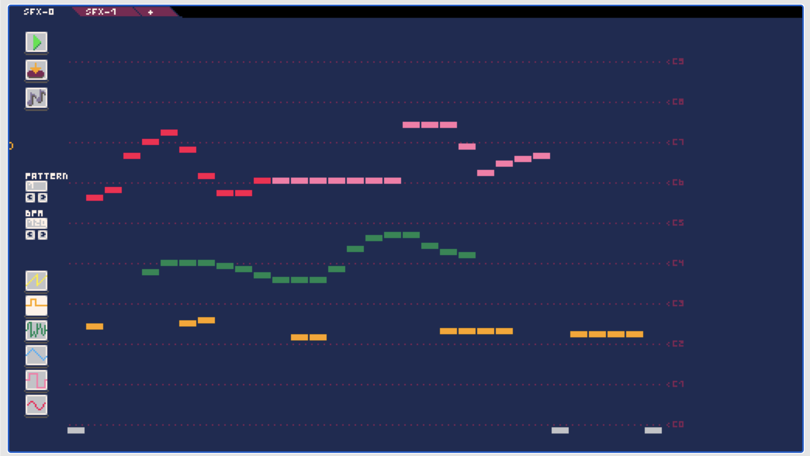
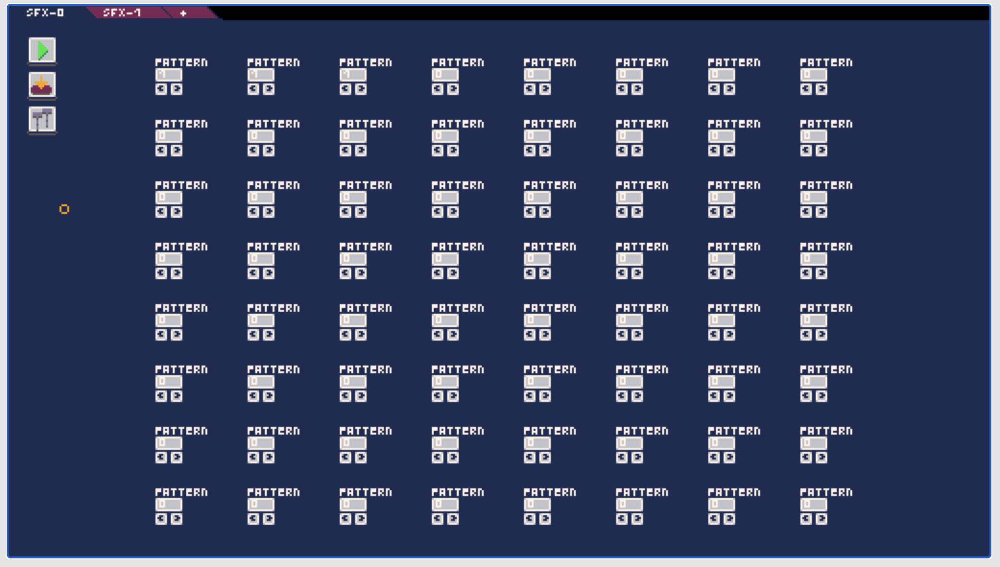

== Tiny CLI

Introducing the Tiny CLI, a powerful command-line interface that allows you to easily create, run, develop, and export games using the Tiny 2D game engine. With the Tiny CLI, you can quickly and easily create a new game project, add assets, and start developing your game in no time.

To get started, simply install the Tiny CLI on your system and create a new project using the `tiny-cli create` command. This will generate a new project directory with all the necessary files and folder structure to start building your game. You can then add assets to your game using the `tiny-cli add` command, which allows you to import images, audio files, and other resources into your project.

The Tiny CLI also includes a powerful development server that allows you to preview your game in real-time as you develop it. Simply run the tiny command and start to update your game.

When you're ready to share your game with the world, the Tiny CLI makes it easy to export your game for web browsers. You can use the `tiny-cli export` command to generate a distributable version of your game that can be published on the web. You can also try the `export` result by using the command `tiny-cli serve`.

Whether you're a seasoned game developer or just getting started, the Tiny CLI is a powerful tool that can help you create, run, develop, and export amazing 2D games with the Tiny engine. With its intuitive command-line interface and powerful features, the Tiny CLI is the ultimate tool for building your next great game.

=== the `tiny-cli create` command

The `tiny-cli create` command is a helpful tool for creating new games for the tiny game engine. This command allows you to easily create a new game by prompting you for a few details about the game you want to create.

==== Usage

To use the `tiny-cli create` command, simply open your terminal and type the following command:

```bash
tiny-cli create
```

This will launch the game creation process and prompt you to enter a name for your new game, along with other parameters to configure it.

==== Creating a New Game

To create a new game using the `tiny-cli create` command, follow these steps:

1. Open your terminal and navigate to the directory where you want to create your new game.

2. Type the following command and press Enter: `tiny-cli create
`

3. Follow the prompts to enter a name for your new game and configure other parameters such as the game's screen resolution, background color, and more.

4. Once you have entered all the required information, the `tiny-cli create` command will create a new folder with the name of your game in the current directory.

5. You can now open this folder and begin developing your new game using the tiny game engine.

==== Running Your Game

To run your newly created game, use the `tiny-cli` command followed by the name of your game's folder. For example:

```bash
tiny-cli my-game
```

This will launch your game and allow you to begin testing and refining your gameplay mechanics.

==== Adding Resources

You can also add resources such as images, sounds, and other assets to your game using the `tiny-cli add` command. For more information on how to use this command, please refer to the associated documentation.

TIP: With the `tiny-cli create` command, you can quickly and easily create new games for the tiny game engine, giving you the flexibility and control you need to bring your game ideas to life.

=== The `tiny-cli run` command

The `tiny-cli run` command is a command line tool for running and testing your tiny game. This command takes only one parameter: the path to the directory containing your game's assets and `_tiny.json` file.

WARNING: If the command is run on Mac OS and some JRE/JDK, the command might not work as it requires to use the JVM option `-XstartOnFirstThread`. In such case, instead of `tiny-cli`, use `tiny-cli-mac` which add this option.

==== Usage

To use the `tiny-cli run` command, simply open your terminal and type the following command:

```
tiny-cli run <game folder>
```

where `<game folder>` is the path to the directory containing your game's assets and `_tiny.json` file.

==== Running a Game

To run your game using the `tiny-cli run` command, follow these steps:

1. Open your terminal and navigate to the directory where your game's `_tiny.json` file is located.

2. Type the following command and press Enter, replacing `<game folder>` with the path to your game's folder: `tiny-cli run <game folder>`

3. The `tiny-cli` command will start your game and display it in a new window.

4. If you make changes to your game's Lua scripts or update any spritesheets, the game will automatically reload to use the latest version of those resources.

With the `tiny-cli run` command, you can quickly test and run your tiny game, making it easy to iterate and refine your game as you develop it.

TIP: Using `tiny-cli run`, You can press Ctrl + R (or ⌘ + R) to record a GIF of the last 8 seconds of your game or Ctrl + S (or ⌘ + S) to take a screenshot.

=== The `tiny-cli add` command

The `tiny-cli add` command allows you to quickly and easily add new spritesheets, sounds, and other assets to your game, making it easy to customize and improve your game's functionality.

==== Usage

To use the `tiny-cli add` command, simply open your terminal and type the following command:

```
tiny-cli add <resource>
```

where `<resource>` is the path to the resource you want to add to your game. The resource can be a png file (which will be added as a spritesheet), a midi file (which will be added as a sound), or any other asset that can be used in the tiny game engine.

==== Adding a Resource

To add a resource to your game using the `tiny-cli add` command, follow these steps:

1. Open your terminal and navigate to the directory where your game's `_tiny.json` file is located.

2. Type the following command and press Enter, replacing `<resource>` with the path to the resource you want to add: `tiny-cli add <resource>`

3. The `tiny-cli add` command will automatically detect the type of resource you are adding and add it to your game accordingly. For example, if you add a png file, it will be added as a spritesheet.

4. The added resource will be reflected in the `_tiny.json` file in the `"spritesheets"`, `"sounds"`, or `"levels"` array, depending on the type of resource you added.

WARNING: Note that the added resource is not automatically copied to your game's folder and needs to be in the same directory as the `_tiny.json` file.

==== Editing the `_tiny.json` File

Alternatively, you can also manually add resources to your game by editing the `_tiny.json` file directly. Simply open the file in a text editor and add the resource to the appropriate array.

With the `tiny-cli add` command, you can easily add new resources to your game and customize its functionality and appearance. Whether you are adding new spritesheets, sounds, or fonts, this command makes it easy to create the game of your dreams with the tiny game engine.

=== the `tiny-cli palette` command

The tiny-cli lib command is used extract a color palette from an image to use it in your `🧸 Tiny` game. This command provides an easy way to use colors from an image as your game's palette color.

==== Usage

To use the `tiny-cli palette` command, follow the syntax:

[source,shell]
tiny-cli palette <image_name>

For example:

[source,shell]
tiny-cli palette my_palette.png

This command will replace your game palette with the palette extract from the file.

You might want to check before which palette will be extract from the image using the flag `--print`:

[source,shell]
tiny-cli palette --print my_palette.png

If, instead to replace your game's color palette,
the flag `--append` can help you to append colors in your game's palette
instead of replacing it:

[source,shell]
tiny-cli palette --append my_palette.png

NOTE: Only colors that are not already in your game's palette will be appended, to not mess with colors index.

=== The `tiny-cli export` command

The `tiny-cli export` command is a tool for exporting your tiny game to a zip file, which includes all the assets needed to run the game in a browser. This command makes it easy to distribute your game and share it with others.

==== Usage

To use the `tiny-cli export` command, simply open your terminal and type the following command:

```bash
tiny-cli export <game folder>
```

where `<game folder>` is the path to the folder containing your game's assets and `_tiny.json` file.

==== Exporting a Game

To export your game using the `tiny-cli export` command, follow these steps:

1. Open your terminal and navigate to the directory where your game's `_tiny.json` file is located.

2. Type the following command and press Enter, replacing `<game folder>` with the path to your game's folder: `tiny-cli export <game folder>`

3. The `tiny-cli export` command will generate a zip file containing all the assets needed to run your game in a browser.

4. The generated zip file will be saved in the same directory as the `_tiny.json` file with the name `<game folder>.zip`.

5. You can now upload the generated zip file to a game hosting platform like itch.io to share your game with others.

6. To run the exported game in a browser, use the `tiny-cli serve` command, which will serve the game from a local server. Type the following command and press Enter: `tiny-cli serve <game folder>.zip`

7. Open your browser and navigate to `http://localhost:8080` to play the exported game.

With the `tiny-cli export` command, you can easily export your tiny game and share it with others. Whether you want to distribute your game on itch.io or share it with friends, this command makes it easy to package your game and get it into the hands of others.

=== the `tiny-cli serve` command

The tiny serve command is used to launch a local web server that allows you to test a game that has been exported using the tiny export command. This is useful for testing and debugging a game locally before publishing it online.

==== Syntax

To use the tiny serve command, open a terminal or command prompt and navigate to the directory containing the exported game zip file. Then, type the following command:

```bash
tiny-cli serve [options] game.zip
```

Where:

`[options]`: Optional arguments to modify the behavior of the command.
`game.zip`: The path to the exported game zip file.

===== Options

`--port [port number]`: Allows you to specify a custom port number to run the server on. The default port number is 8080.

==== Usage

To run the tiny serve command, you can use the following examples:

```bash
tiny-cli serve myGame.zip
```

This will launch the local web server on the default port number (`8080`) and serve the game located in the `myGame.zip` file.

```bash
tiny-cli serve MyGame.zip --port 8081
```

This will launch the local web server on port number `8081` and serve the game located in the `MyGame.zip` file.

Once the server is running, you can access the game in your web browser by navigating to the URL `http://localhost:[port number]/`. For example, if you used the default port number, you would navigate to `http://localhost:8080/` in your web browser to access the game.

NOTE: The tiny serve command is intended for local testing only and should not be used to serve your game online. When you are ready to publish your game, you should upload the exported game files to a web server and serve them from there.

=== the `tiny-cli sfx` command

The tiny-cli sfx command is used to start a SFX edtor to generate sound to use in your `🧸 Tiny` game.

https://dwursteisen.itch.io/tiny-sfx-editor[This SFX editor can be tried online] on itch.io.






==== Usage

To use the `tiny-cli sfx` command, follow the syntax:

[source,shell]
tiny-cli sfx

The command can be used to edit sounds used by your `🧸 Tiny` game.

[source,shell]
tiny-cli sfx <game>

The editor will be run with all SFX sounds from your game loaded.

=== the `tiny-cli lib` command

The tiny-cli lib command is used to download and add Lua libraries to your `🧸 Tiny` game. This command provides an easy way to enhance the functionality of your game by incorporating libraries.

==== Usage

To use the `tiny-cli lib` command, follow the syntax:

[source,shell]
tiny-cli lib <library_name>

Replace <library_name> with the name of the library you want to download and add to your game.

For example, to download and add the particles library to your game, you would run the following command:

[source,shell]
tiny-cli lib particles

This command will download the particles library and add it to your game.

==== Library Repository

The libraries are downloaded from the following URL:

https://github.com/minigdx/tiny/tree/main/tiny-repository-libs

This repository contains a collection of Lua libraries that can be used with Tiny games. Each library is maintained separately and provides additional features and functionality to enhance your game development process.

==== Examples

Here are a few examples to illustrate how to use the `tiny-cli lib` command:

Download and add the particles library to your game:
[source,shell]
tiny-cli lib particles

This command will download the particles library from the repository and add it to your game.
