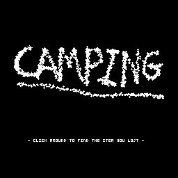
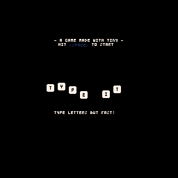
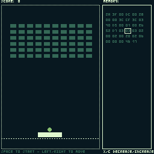
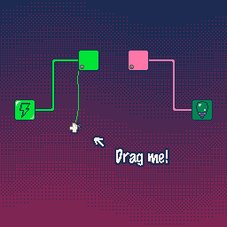
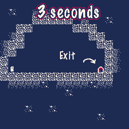
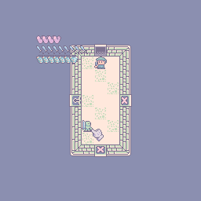
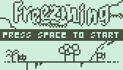
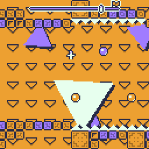
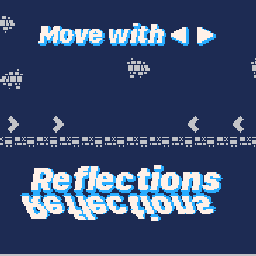

== Tiny Showcase

Get inspired by what's possible with `🧸 Tiny`! This showcase features amazing games created by our community, demonstrating the versatility and creative potential of the Tiny game engine.

Here are a few examples of games created using `🧸 Tiny`.

TIP: Want your game to appear here? Create a post about it in https://github.com/minigdx/tiny/discussions/categories/show-and-tell[the Show and tell board] and share all information about it.
