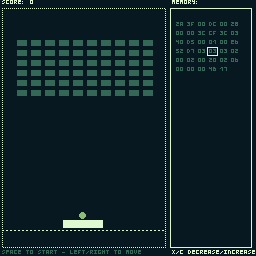

== Tiny Showcase

Here are a fews examples of game created using `🧸 Tiny`.

image:sample/camping.gif[link=https://dwursteisen.itch.io/trijam-camping]
image:sample/level-up.gif[link=https://dwursteisen.itch.io/trijam-220-type-it]

image:sample/connect_me.gif[link=https://dwursteisen.itch.io/connect-me]
image:sample/only_three_seconds.gif[link=https://dwursteisen.itch.io/one-light-for-three-seconds]

TIP: Want your game to appear here? Create a post about it in https://github.com/minigdx/tiny/discussions/categories/show-and-tell[the Show and tell board] and share all information about it.
